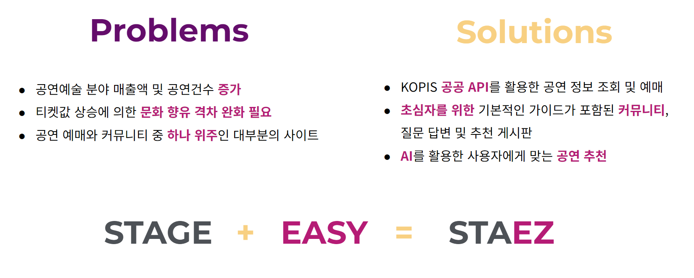

# STAEZ

> 공연과 커뮤니티의 결합

## 프로젝트 개요

- 개발 기간: 2023-00-00 ~ 2023-00-00

## 기술 스택
### Front-End

   

### Back-End

   

### Communication

  

## 팀원 소개

| 이름 | 김효영 | 김남주 | 이원기 | 장용준 | 주재완 |
| --- | --- | --- | --- | --- | --- |
| 역할 | 조장 | 이슈 관리자 | DB 관리자 | 형상 관리자 | 일정 관리자 |
|ID| [hyoyoungjjang](https://github.com/hyoyoungjjang) | [anjoo-k](https://github.com/anjoo-k) | [prove97](https://github.com/prove97) | [yonhjoon](https://github.com/yonhjoon) | [red-sprout](https://github.com/red-sprout) |

## 역할 분담
### 김효영
- 헤더, 푸터
- 메인 공연
- 검색 결과 페이지
- 고객센터(1대 1문의, FAQ)
- <ins>**캘린더(공연캘린더, 예매캘린더)**</ins>
- <ins>**예매(단계별로 페이지 생성)**</ins>

### 김남주
- <ins>**공연 메인 페이지**</ins>
- 공연 세부 페이지
- <ins>**공연 API 페이지**</ins>
- 공연 API 세부페이지

### 이원기
- 마이페이지 메인
- <ins>**회원정보 변경**</ins>
- 찜목록
- <ins>**한줄평**</ins>
- 예매내역
- 커뮤니티 관리
- 1:1 문의 내역

### 장용준
- 로그인 페이지
- <ins>**회원가입 페이지**</ins>
- 아이디 찾기 페이지
- 비밀번호 찾기 페이지

### 주재완
- 커뮤니티 페이지
- 공지사항 페이지
- <ins>**관리자 페이지**</ins>
- <ins>**공연 추천 챗봇**</ins>
- <ins>**공연 API 백엔드**</ins>

## 사용 라이브러리 및 API
- KOPIS 공연예술 통합전산망 API
- 네이버, 카카오, 구글 로그인 API
- slick slider
- summernote
- 카카오페이 API
- chatGPT 3.5 API
- 주소 - 카카오 우편번호 서비스 API
- 휴대폰 번호 인증 - coolsms API
